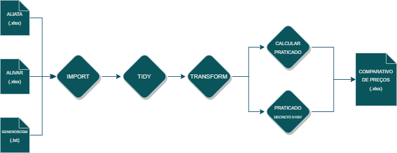

---
output:
  html_document:
    css: css/style.css
---


<div align="center">
<br>
  <a href="https://portalibre.fgv.br/">
    
  </a>
</div>


<br><div align="center">
  <strong>
  <font size="+1">
  <span style="color:MidnightBlue">
  PREÇOS DE GÊNEROS ALIMENTÍCIOS - PCRJ
  </span>
  </font>
  </strong>
</div>


Este repositório contém a documentação do projeto de automatização da planilha de análise comparativa dos preços de atacado, varejo e praticado de Gêneros Alimentícios - PCRJ. 


---

### Sumário
1. [Introdução](#intro)
2. [Objetivo](#objetivo)
3. [Estrutura do diretório](#dir)
4. [Guia do usuário](#guia)
5. [Visão Geral](#overview)
6. [Dicas](#dicas)
7. [Contato](#contato)


### [Introdução](#intro)

Anteriormente, as planilhas ALIATA e ALIVAR eram organizadas manualmente para que fosse possível calcular os preços praticados, as variações entre os preços da quinzena atual e anterior, bem como comparar os preços de atacado, varejo e praticado em diferentes metodologias. Como resultado desse trabalho, é gerada uma planilha de análise para auxiliar a rotina de fechamento de preços de Gêneros Alimentícios no Sistema (SFPC). 

**Objetivo:** O objetivo do projeto foi delegar para o computador tarefas que se repetiam a cada nova referência, como preparação, transformação e manipulação de dados, para que os analistas disponham de mais tempo para tarefas mais complexas. 
Após o projeto, o fluxo de trabalho foi otimizado, mitigando erros de manipulação. Agora, os mesmos outputs são gerados em apenas alguns segundos, o que proporciona mais agilidade e eficiência ao processo, liberando o analista para se concentrar na análise dos preços calculados e do setor.

### [Estrutura do diretório](#dir)

A seguir está a estrutura do diretório, com a descrição de cada pasta e arquivo:

```
.
├─ Projeto.Rproj                        (Arquivo para abrir e organizar o projeto)        
├─ main.R                               (Script principal)            
├─ src                                  
│   └─ code/gerar_carga.R               (Script que gera as planilhas de carga para cada job)
│   └─ Modelo de carga - JOB.xlsx       (Templates em Excel, separados por job, para ser lido pelo R)
├─ inputs                       
    └─ ALIATA.xlsx                      (Origem: SFPC\planilhao)
    └─ ALIVAR.xlsx                      (Origem: SFPC\planilhao)
    └─ GENEROSCGM.txt                   (Origem: SISTEMAS\custo\load\PCRJaliv)
    └─ README.html 
├─ excel                                (Pasta para armazenar dados de saída do projeto - Resultados)
└─ README.html                          (Este manual)
```

### [Guia do usuário - Como utilizar a ferramenta?](#guia)


A seguir as etapas que devem ser realizadas pelo usuário a cada nova referência:

1. Atualizar a pasta `inputs` 

2. Abrir o projeto no RStudio: `Projeto.Rproj`

3. Executar o script: `main.R` (Atalho: Ctrl + Alt + R)

4. Fechar o Rstudio (não é necessário salvar).

5. A planilha comparativa dos preços pode ser encontrada na pasta `excel`: QMMAAAA-COMPARATIVO-AAAAMMDD.xlsx

---

### [Visão Geral](#overview)

O diagrama abaixo resume o fluxo de trabalho do projeto de automatização da análise comparativa de preços de Gêneros Alimentícios - PCRJ.

O processo começa com a entrada dos dados brutos (planilhão), os quais são organizados e limpos utilizando técnicas de transformação e limpeza de dados. Em seguida, os dados são processados para calcular os preços sob diferentes metodologias, conforme previsto no decreto 51057.

Os preços são comparados com os valores da quinzena anterior, a fim de identificar as variações nos preços praticados. Por fim, é gerado um template no formato Excel com as informações coletadas e processadas, possibilitando a análise e tomada de decisão pelos analistas.




---

### [Dicas](#dicas)

Aqui estão algumas dicas para ajudar você a utilizar esta pasta com eficiência:

- Certifique-se de que os arquivos de input estejam na pasta antes de executar o código.

- Mantenha a pasta organizada e livre de outros arquivos que não sejam os mencionados acima.


### [Contato](#contato)

Se você tiver alguma dúvida ou problema com o uso desta ferramenta, não hesite em entrar em contato através do e-mail: winicius.faquieri@fgv.br.

Obrigado!

